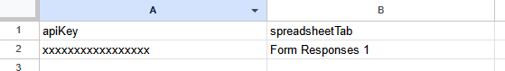
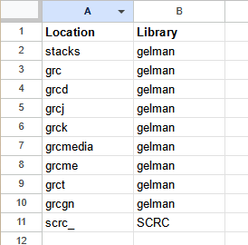
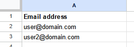
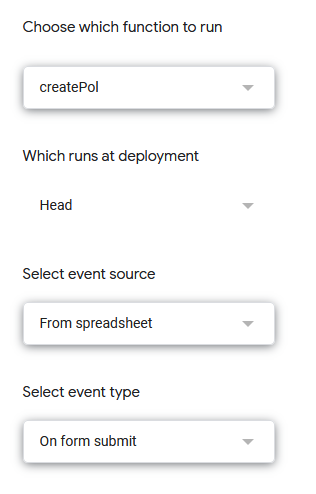

### Creating Alma POL from Google Form submissions ###

**Purpose**

This Google Apps script allows for calling the Alma POL API and using Google Forms data from a Google Sheet to create a physical one-time POL with a brief bib and item record in Alma.

**Setup**

1. Clone the repo and/or download `alma-create-pol.js`.

2. Create or modify an existing Google Sheets document that includes a tab with form submissions as follows:
   
   a. Create a tab called `config`.
   
   b. This sheet should have the following column headers:
     
     - apiKey
     
     - spreadsheetTab

   c. Include your API key from the [Ex Libris Developer Network](https://developers.exlibrisgroup.com/) in the first row under the `apiKey` column.

   d. Include the name of the tab in the current spreadsheet where the form submission data is recorded.
   
   e. Your `config` tab should look as follows: 

   

   f. Create a tab called `locationMapping` with a column for location code and a column for library code.

   

   g. Create a tab called `authorizedUsers` with a column of email addresses of users who you are allowing to create POLs using the Google Form.

   

3. Now open the Script Editor under the Tools menu in Sheets, and create a new project (following the relevant instructions [here](https://developers.google.com/apps-script/guides/sheets)). 

4. Select `New` --> `Script` from the `File` menu, and paste in the code from `alma-create-pol.js`. 

5. Modify the line of code `var spreadsheet = SpreadsheetApp.openById('');` to include the ID string of your Google Sheet. (The ID is the long identifier described on [this page](https://developers.google.com/sheets/api/guides/concepts) of the Google Sheets API documentation.) Make sure your spreadsheet ID is between the quotes in this line of code. Then save the code by clicking the floppy disk icon.

6. Modify the lines of code mapping variables to cells as needed to ensure that column numbers correspond to the correct columns in the form responses sheet.

7. Set up a [project trigger](https://developers.google.com/apps-script/guides/triggers/) to run the createPol function on form submission.

